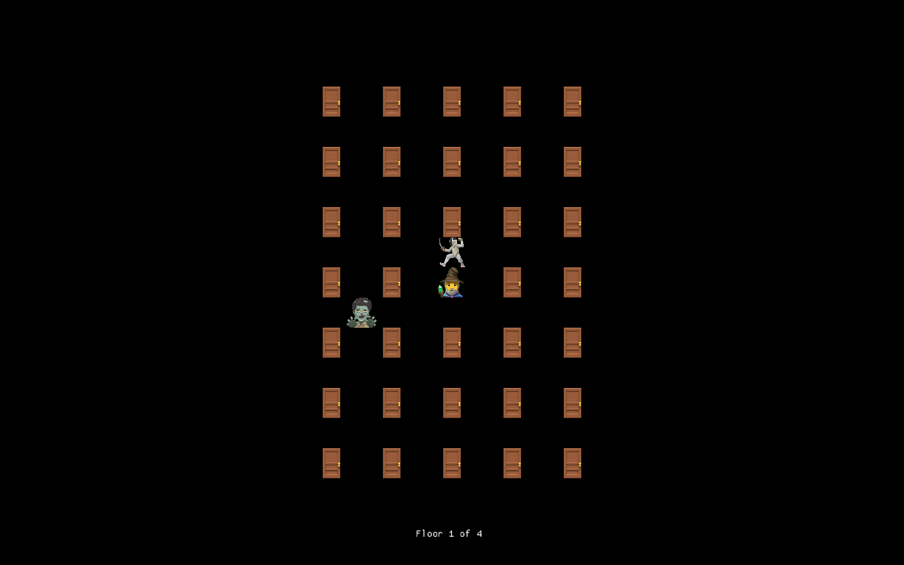
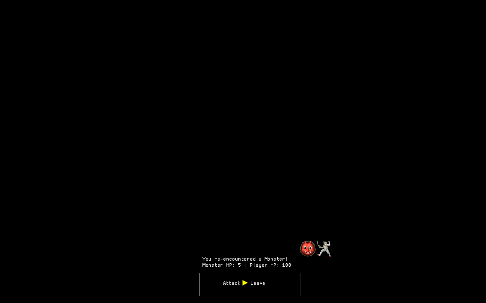
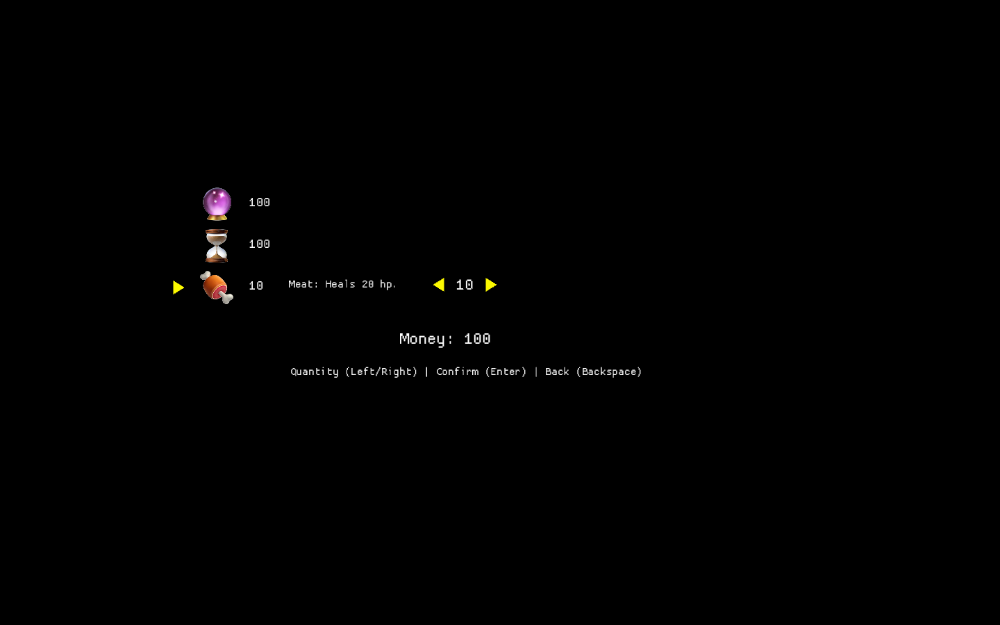
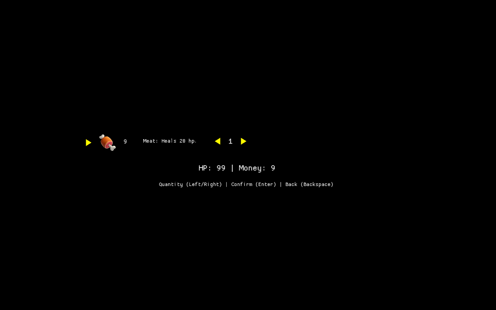
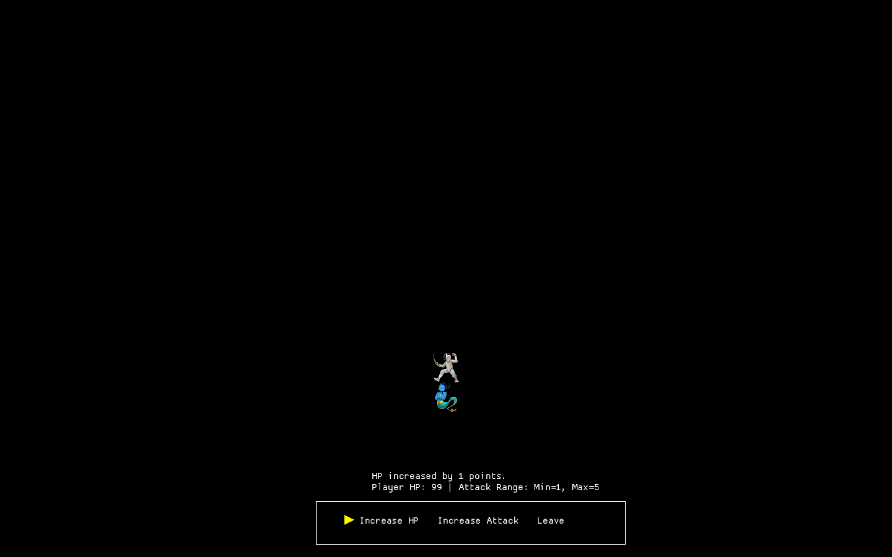

# Castle Descent 

A simple roguelike game implemented in Rust. The objective is to reach the final floor of a procedurally generated castle (represented as a 3D array) while avoiding the zombie.

## Gameplay

### Controls

Movement: Arrow keys

#### Features

#### Main Game View

#### Combat System
Battle monsters to earn gold and random item drops.

#### Merchant Shop
Money earned from battles can be used to purchase items from the merchant shop and the inventory can be opened by pressing "i".

#### Special Encounters
While some doors may contain monsters and the exit to the next floor, others may contain:

- 🧞 Genies that boost your attack or increase HP.
- 🧚 Fairies that restore your HP.

